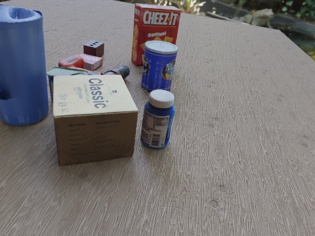
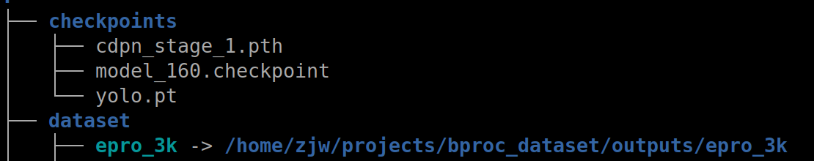
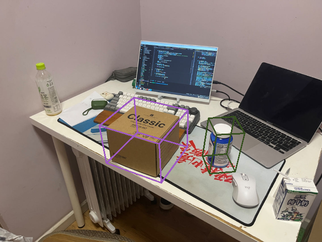

# EPro-PnP-6DoF for Bop PBR Dataset 

This is modified from the official implementation of End-to-End Probabilistic Perspective-n-Points for 6DoF object pose estimation. [[epro-pnp](https://github.com/tjiiv-cprg/EPro-PnP.git)]

The project is totally trained with virtual dataset, which is Bop dataset format.  

The inference pipline is two stages. First, yolov8 detection model crops objects from origin images. Then ERro-PnP-6DoF estimation objects poses from croped images. 

## Photorealistic Dara
The dataset is rendered by Blender and the models of objects are scanned by luma, which is a Nerf based 3D scanner app.

Example:


## Environment

The code has been tested in the environment described as follows:

- Linux (tested on Ubuntu 22.04)
- Python 3.10
- [PyTorch](https://pytorch.org/get-started/previous-versions/) 2.0.0

An example script for installing the python dependencies under CUDA 11.8:

```bash
# Create conda environment
conda create -y -n epropnp_python=3.10
conda activate epropnp

# Install pytorch
conda install pytorch torchvision torchaudio pytorch-cuda=11.8 -c pytorch -c nvidia

# Install other dependencies
pip install opencv-python==4.5.1.48 pyro-ppl==1.4.0 PyYAML==5.4.1 matplotlib termcolor plyfile easydict scipy progress tensorboardx ultralytics
```


## Setup
1. Install dependencies:

2. Download dataset and model checkpoints

- [dataset](https://drive.google.com/file/d/1GONuHl4076H0FULvYxl7cbIDrQYwtz7s/view?usp=drive_link) - unzip and placed in dataset dir.

- [epro-pnp](https://drive.google.com/file/d/11HepV8KRTYImkF2dbf6O3K3DowgHaN-x/view?usp=drive_link), [yolov8](https://drive.google.com/file/d/1CDsdSjGkcDwXEFwsg4Li-zd5fO21GUEr/view?usp=drive_link) - place all checkpoints in checkpoints dir.

Example folder orgnization



## Usage

### Train
```bash
python train.py --cfg exps_cfg/bop/bop_no_init.yaml
```
### Inference
```bash
./scripts/inference.sh ../imgs/test.jpeg
```
Poses visualization.

